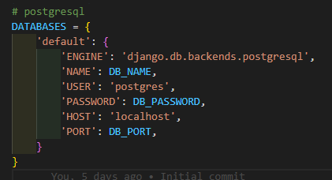
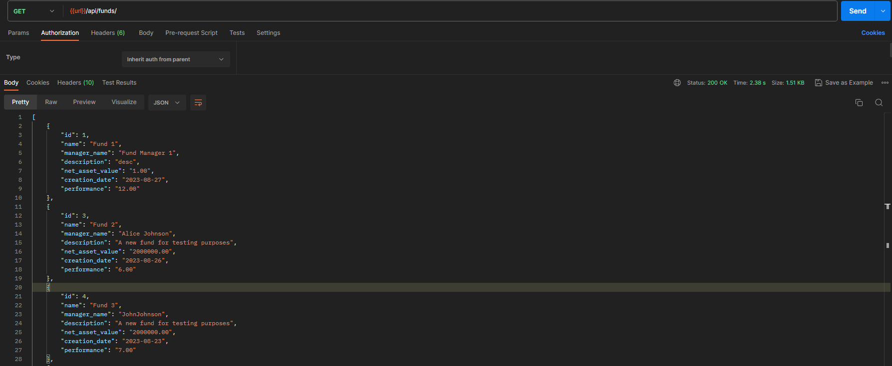
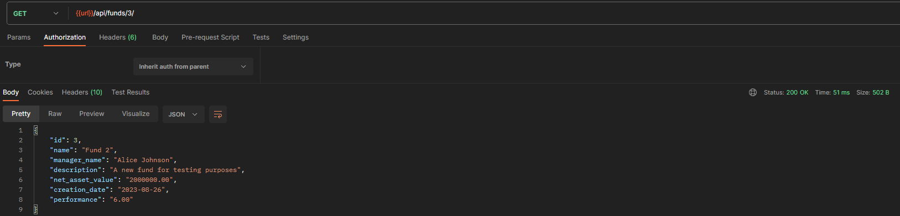
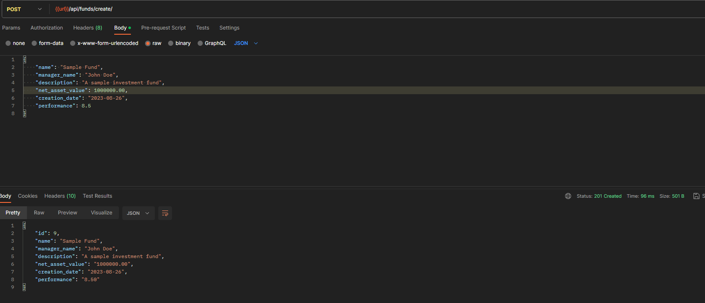
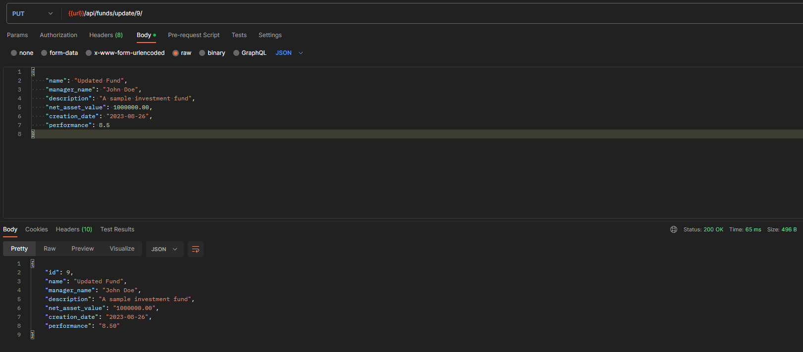
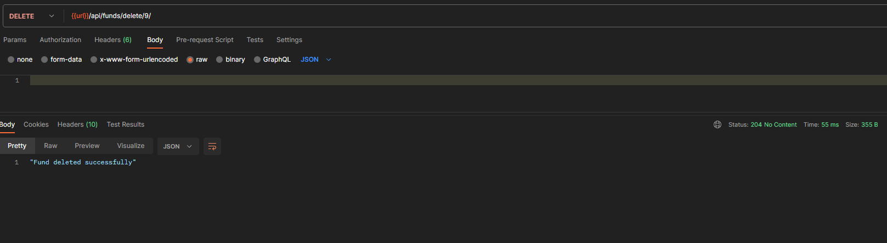
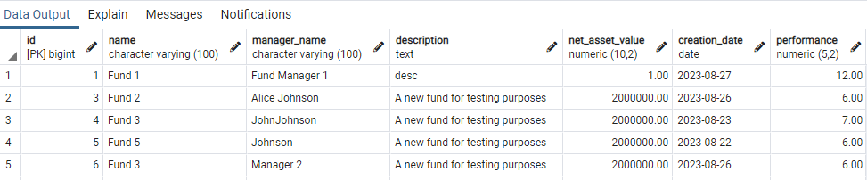

# Fund Management System Documentation

Backend For Fund Management System using Django.

## 1. Libraries and Frameworks

- Django
- Django Rest Framework (DRF)
- PostgreSQL

## 2. How to Run the Project

- Clone the repository from GitHub.
- Create a virtual environment and install project dependencies
- Create the `.env` file in the root directory of the project.
- Add the following line to set your Django secret key and Database variables:

  1. SECRET_KEY=your_secret_key_here
  2. POSTGRES_DB_PASSWORD=your_database_password
  3. POSTGRES_DB_PORT=your_database_port
  4. POSTGRES_DB_NAME=your_database_name

####

- Configure the PostgreSQL database settings and Secret Key in settings.py. Read from .env files for below variables:

  1. SECRET_KEY = os.getenv("SECRET_KEY")
  2. DB_NAME = os.getenv("POSTGRES_DB_NAME")
  3. DB_PORT = os.getenv("POSTGRES_DB_PORT")
  4. DB_PASSWORD = os.getenv("POSTGRES_DB_PASSWORD")

  

- Run migrations using python manage.py migrate.
- Start the development server with python manage.py runserver.
- Access the API at http://127.0.0.1:8000/api/.

## 3. API Endpoints

### List All Funds:

- Endpoint: /api/funds/
- Method: GET
- Description: Retrieve a list of all investment funds.

Here is the request and response:

### Retrieve Fund by ID:

- Endpoint: /api/funds/<fund_id>/
- Method: GET
- Description: Retrieve details of a specific investment fund by its ID.

Here is the request and response:

### Create Fund:

- Endpoint: /api/funds/create/
- Method: POST
- Description: Create a new investment fund.

Here is the request and response:

### Update Fund:

- Endpoint: /api/funds/update/<fund_id>/
- Method: PUT
- Description: Update details of a specific investment fund by its ID.

Here is the request and response:

### Delete Fund:

- Endpoint: /api/funds/delete/<fund_id>/
- Method: DELETE
- Description: Delete a specific investment fund by its ID.

Here is the request and response:

## 4. SQL Database Schema

The Fund Management System utilizes a PostgreSQL database to store investment fund data. Below is an overview the table:

### Table: InvestmentFund

The `InvestmentFund` table serves as the core entity to store information about investment funds.

| Column            | Data Type | Description                              |
| ----------------- | --------- | ---------------------------------------- |
| `id`              | Integer   | Unique identifier for each fund.         |
| `name`            | Text      | Name of the investment fund.             |
| `manager_name`    | Text      | Name of the fund manager.                |
| `description`     | Text      | Description of the fund's objectives.    |
| `net_asset_value` | Decimal   | Current net asset value of the fund.     |
| `creation_date`   | Date      | Date of fund creation.                   |
| `performance`     | Decimal   | Performance of the fund as a percentage. |

